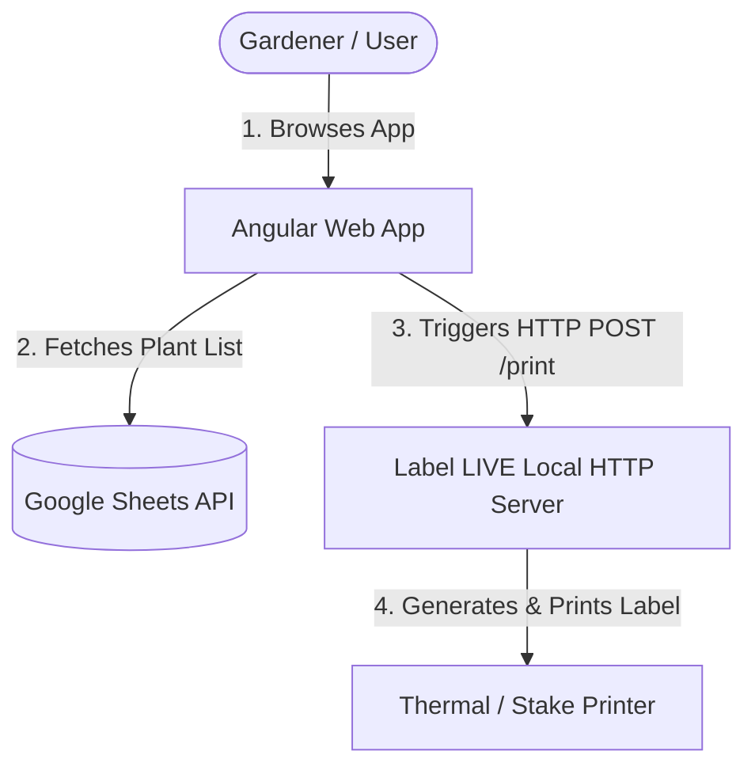

An on-demand, remote web interface designed to fetch plant lists from a Google Sheet and print plant stake labels using the [Label LIVE](https://label.live/) application. This setup enables quick and reliable label printing from any web-connected device (such as an iPad or smartphone in the greenhouse) directly to a local label printer.

---

## 🛠️ System Architecture



---

## 📋 Prerequisites

Ensure you have the following installed and set up before proceeding:

1. **Node.js**: Version 18.x or 20.x is recommended (compatible with Angular 17).
2. **Label LIVE**: Installed on the computer physically connected to your label printer.
3. **Google Cloud Console Account**: Needed to enable Google Sheets API and generate an API key.

---

## 🚀 Setup Instructions

### Step 1: Clone and Install Dependencies

Clone this repository to your local machine and run:

```bash
npm install
```

### Step 2: Set Up Google Sheets Data Source

This app pulls your plant inventory directly from a Google Sheet.

1. **Create the Google Sheet:**
   - Create a spreadsheet with at least two columns.
   - Name the worksheet exactly `Sheet1`.
   - Set row 1 as your headers (e.g. `Plant Name` in Column A, `URL` in Column B).
   - Populate rows 2+ with your plant data. Column A should contain the plant name, and Column B should contain the URL (used for the generated QR code or barcode).

2. **Obtain API Credentials:**
   - Go to the [Google Cloud Console](https://console.cloud.google.com/).
   - Create a new project (e.g. `plant-stake-labeler`).
   - Navigate to **APIs & Services > Library**, search for **Google Sheets API**, and click **Enable**.
   - Navigate to **APIs & Services > Credentials**, click **Create Credentials**, and select **API Key**. Copy this key.

3. **Get the Spreadsheet ID:**
   - Copy the spreadsheet ID from the URL of your Google Sheet:
     `https://docs.google.com/spreadsheets/d/SPREADSHEET_ID_HERE/edit`

4. **Configure the Environment:**
   - Create a file at `src/app/environment.ts` and populate it with your credentials:
     ```typescript
     export const environment = {
       spreadsheetId: 'YOUR_SPREADSHEET_ID_HERE',
       apiKey: 'YOUR_GOOGLE_API_KEY_HERE'
     };
     ```

### Step 3: Configure Label LIVE App Integration

Label LIVE acts as the local print server. The Angular application communicates with Label LIVE using its built-in HTTP server.

1. **Configure Label LIVE Local API Server:**
   - Open **Label LIVE**.
   - Go to **Settings** or the **Integrate** panel.
   - Enable the **HTTP/Web Server** or **Local API**.
   - By default, Label LIVE listens on port **`11180`**. Ensure the port matches your application configuration.

2. **Create Your Label Template:**
   - Design your plant stake label in Label LIVE.
   - Choose the dimensions corresponding to your plant stakes.
   - Add a Text element for the plant name and set its variable name to exactly **`PLANT_NAME`**.
   - Add a Barcode or QR Code element and set its variable name to exactly **`URL`**.
   - Save the design. Ensure the file name matches `DESIGN_NAME` in `app.config.ts`.

3. **Align Application Settings:**
   - Open [src/app/app.config.ts](file:///Users/micha/Documents/GitHub/plant-stake-labeler/src/app/app.config.ts) and verify the following variables:
     ```typescript
     // The filename (without extension) of your Label LIVE design template
     export const DESIGN_NAME = 'MC_Label';

     // The name of your physical printer as shown on your system
     export const PRINTER_ID = 'System-TSC TX310';

     // IP and port of the machine running Label LIVE
     export const HOST_IP = '10.0.0.20';
     export const HOST_PORT = 11180;
     ```
     
     > [!TIP]
     > If you are running the Angular app on the same computer as Label LIVE, you can set `HOST_IP` to `'localhost'` or `'127.0.0.1'`.
     > If you are printing from other devices on the same local network (e.g., phone or tablet), set `HOST_IP` to the local LAN IP address (e.g., `192.168.1.X` or `10.0.0.X`) of the computer running Label LIVE.

---

## 💻 Running the App

Start the development server using:

```bash
npm start
```

Navigate to `http://localhost:4200/` in your web browser. You can search/filter plants fetched from Google Sheets, choose the number of copies, and hit **Print** to send a payload directly to the Label LIVE local HTTP server.

---

## 🔧 Development and Commands

This project uses Angular CLI version 17.3.17.

### Development Server
Run `ng serve` for a dev server. Navigate to `http://localhost:4200/`.

### Build
Run `ng build` to build the project. The build products will be saved in `dist/`.

### Running Unit Tests
Run `ng test` to execute the unit tests via Karma.
