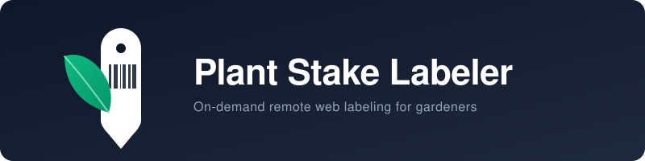
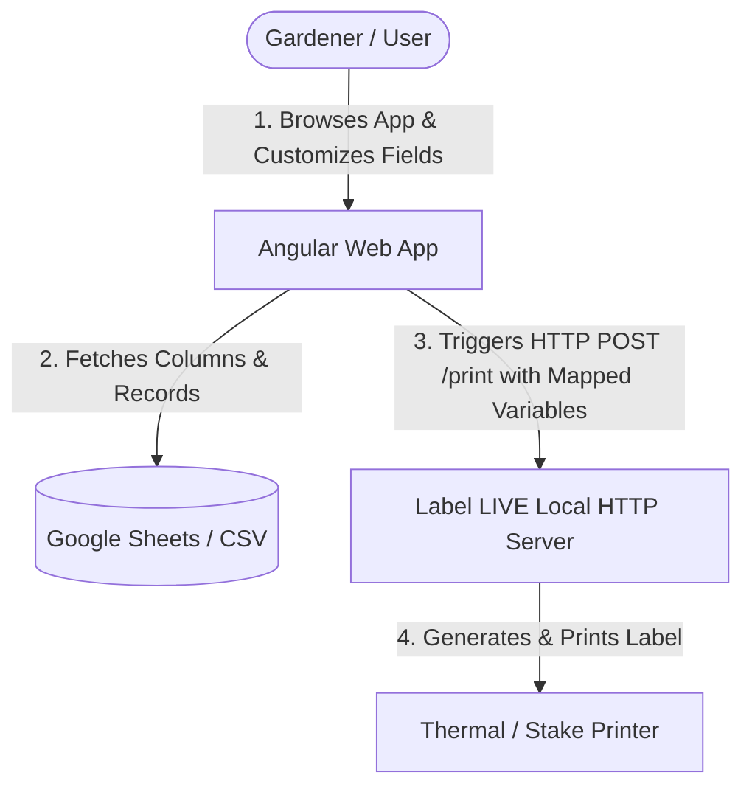

[](https://github.com/helfrichmichael/plant-stake-labeler/actions/workflows/test.yml)

An on-demand, remote web interface designed to fetch plant lists from a Google Sheet and print plant stake labels using the [Label LIVE](https://label.live/) application. This setup enables quick and reliable label printing from any web-connected device (such as an iPad or smartphone in the greenhouse) directly to a local label printer.

---

## 🛠️ System Architecture



---

## 🖥️ Quick Start for Desktop (macOS & Windows)

### 🍎 macOS (1-Click Launch)
1. Double-click **`start.command`** in the project root.
2. The launcher checks if the app is built, starts the local server, and opens **`http://localhost:4200`** in your default browser.
3. Click the ⚙️ **Settings** gear icon in the header to configure your Google Sheet and printer.

### 🪟 Windows (1-Click Launch)
1. Double-click **`start.bat`** in the project root.
2. The launcher starts the local server and opens **`http://localhost:4200`** in your default browser.

---

## 📋 Prerequisites

1. **Label LIVE**: Installed on the computer physically connected to your label printer.
2. **Google Sheet**: A spreadsheet containing your plant inventory.
3. *(Optional)* **Node.js**: If you plan to develop or build the application from source (Node 18.x or 20+).

---

## ⚙️ In-App Configuration (No Code Editing Required!)

All settings can be customized directly in the web browser by clicking the **⚙️ Settings** icon in the header. Settings are saved to `localStorage` automatically.

### 1. Data Source (Google Sheet / CSV)
* **Spreadsheet URL / ID:** Paste your Google Sheet URL (e.g. `https://docs.google.com/spreadsheets/d/.../edit`).
* **Zero-Setup Public Sheets:** Simply set your Google Sheet sharing to *"Anyone with the link can view"*. The app reads headers and rows directly without requiring a Google Cloud project or API key!
* **Worksheet Name:** Enter the tab name (defaults to `Sheet1`).
* **Search / Title Column:** Select which column from your sheet is used for autocomplete search (e.g., `Plant Name`).
* **Test & Fetch Sheet Columns:** Click this button in Settings to auto-detect all columns in your sheet.

### 2. Dynamic Field & Variable Mappings
You can map any number of columns from your Google Sheet to your Label LIVE template:
* **Label LIVE Variable:** The variable name defined in Label LIVE (e.g., `PLANT_NAME`, `URL`, `PRICE`, `SKU`, `CARE_INFO`).
* **Google Sheet Column:** The corresponding column in your spreadsheet.
* **Auto-Match Button:** Automatically creates variable mappings matching all detected sheet headers.

### 3. Label LIVE & Printer Configuration
* **Design Name:** The name of your design file in Label LIVE (e.g., `MC_Label`).
* **Printer ID:** The system name of your thermal label printer (e.g. `System-TSC TX310`).
* **Host IP & Port:** Default is `127.0.0.1` and `11180`.

---

## 🚀 Manual Setup & Development

### Step 1: Install Dependencies
```bash
npm install
```

### Step 2: Running the Development Server
```bash
npm start
```
Navigate to `http://localhost:4200/`.

### Step 3: Run Unit Tests
```bash
npm test
```

---

## 🏗️ Building & Production Web Server Deployment

To run the application across your network (e.g., from an iPad or phone in the greenhouse), build the static app bundle and deploy it to a web server like **Nginx** or host it on **GitHub Pages** / **Cloudflare Pages**.

> [!CAUTION]
> **Security Notice – Do NOT Open Router Ports!**
> There is **no built-in user authentication** in this application. **Do NOT use router port forwarding or expose this web app or port 11180 directly to the public internet by opening ports.**
> 
> For remote access outside your local network, always use a secure reverse proxy solution with authentication (such as a **Cloudflare Tunnel with Cloudflare Access / Zero Trust**) or a private encrypted mesh network (such as **Tailscale** or **WireGuard**).

### Build the Application
```bash
npm run build
```
This compiles the project into production-optimized static HTML, JavaScript, and CSS assets under `dist/label-live-app/browser/`.

### Serve via Python on Local Network
```bash
python3 -m http.server 4200 --directory dist/label-live-app/browser
```

### Configure Nginx (Local LAN Access)
Create an Nginx configuration file (e.g. `/etc/nginx/sites-available/plant-stake-labeler`):

```nginx
server {
    listen 80;
    server_name plant-labeler.local; # Replace with your local server IP or hostname

    root /var/www/plant-stake-labeler;
    index index.html;

    location / {
        try_files $uri $uri/ /index.html;
    }
}
```

---

## 🎨 Label LIVE Template Setup

A starting template file [MC_Label.lsc](file:///Users/micha/Documents/GitHub/plant-stake-labeler/MC_Label.lsc) is included in the root of this repository.

1. Open **Label LIVE**.
2. Go to **Settings** or the **Integrate** panel and enable the **Local API / HTTP Server** on port `11180`.
3. In your template design, name your text/barcode variables (e.g. `PLANT_NAME`, `URL`, `PRICE`).
4. In the app's **Settings > Field Mappings**, map those variable names to your Google Sheet column headers.
